# Exam-Portal

This is a webapp built using Spring-boot and ReactJS that provides functionality to conduct and take quizzes. Admin can add, update, delete different quizzes, the categories to which these quizzes belongs and also questions of those quizzes. While normal user can attempt those quizzes as well as see the scorecards of their previous attempts.

- Backend API Endpoints  
  

## Output :-

- Login Page 
  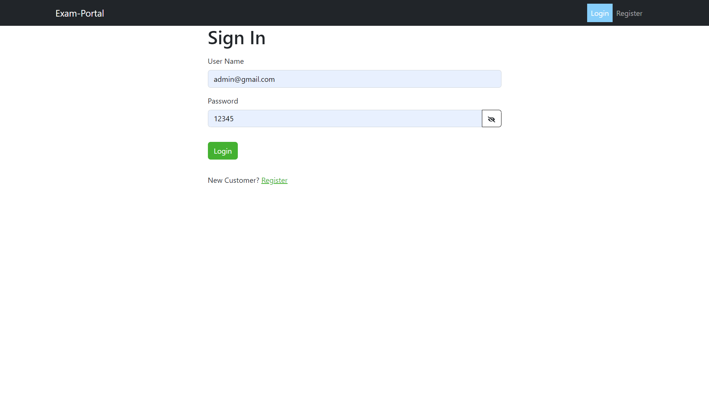

- Registration Page 
  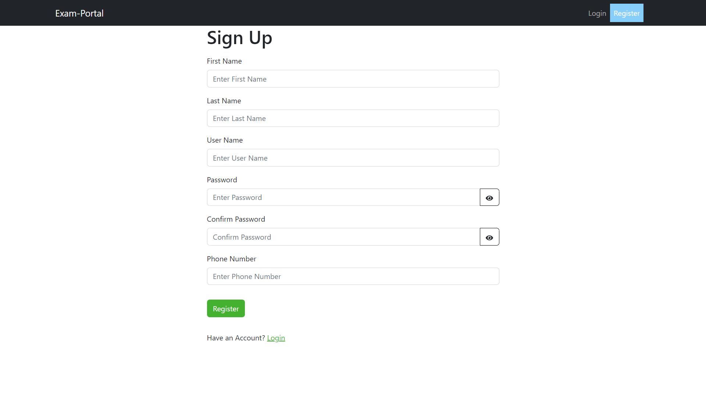

- Admin Profile Page 
  

- Admin Categories Page 
  

- Admin Add Category Page 
  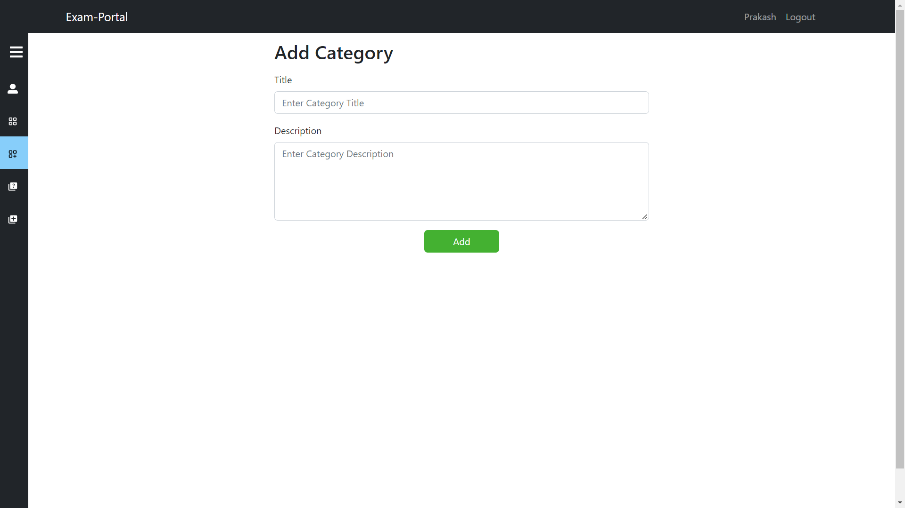

- Admin Quizzes Page 
  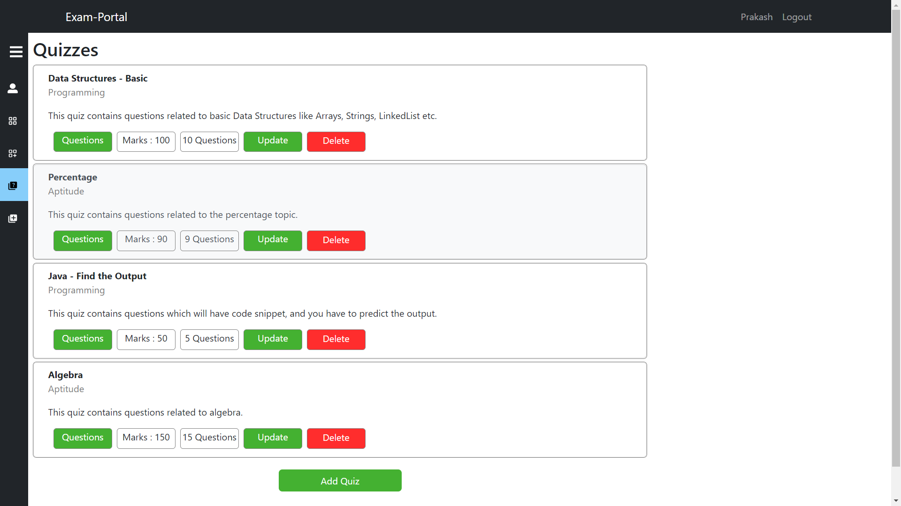

- Admin Add Quiz Page 
  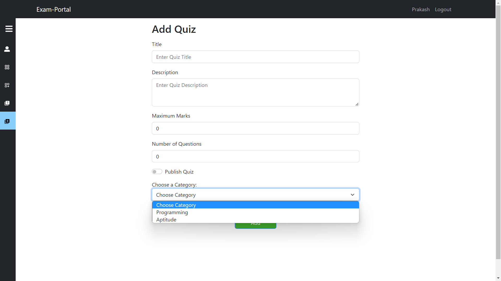

- Admin Delete Quiz Confirmation Alert 
  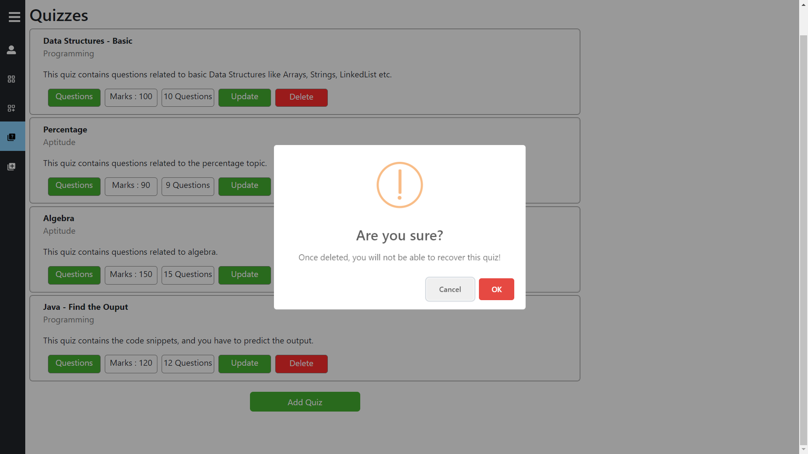

- Admin Delete Quiz Alert 
  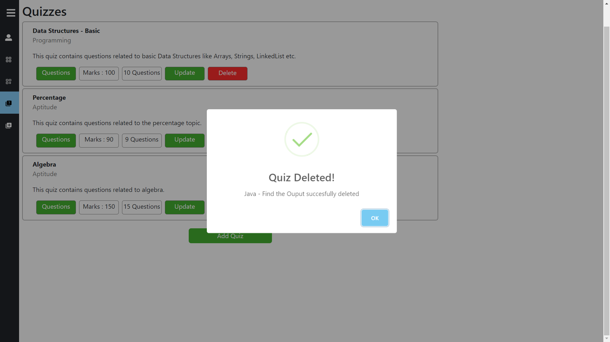

- Admin Questions Page 
  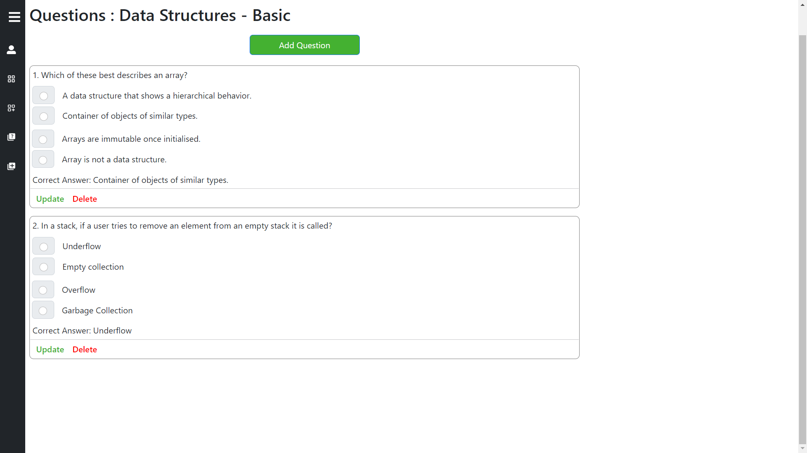

- Admin Add Question Alert 
  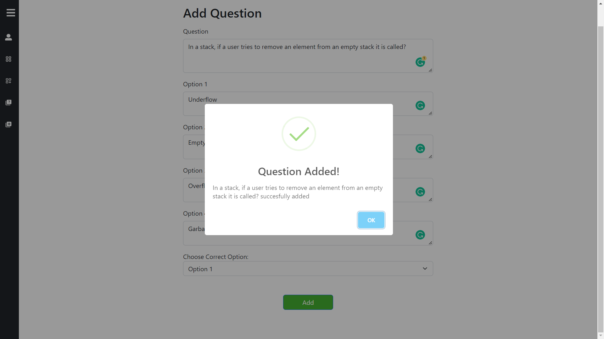

- User Profile Page 
  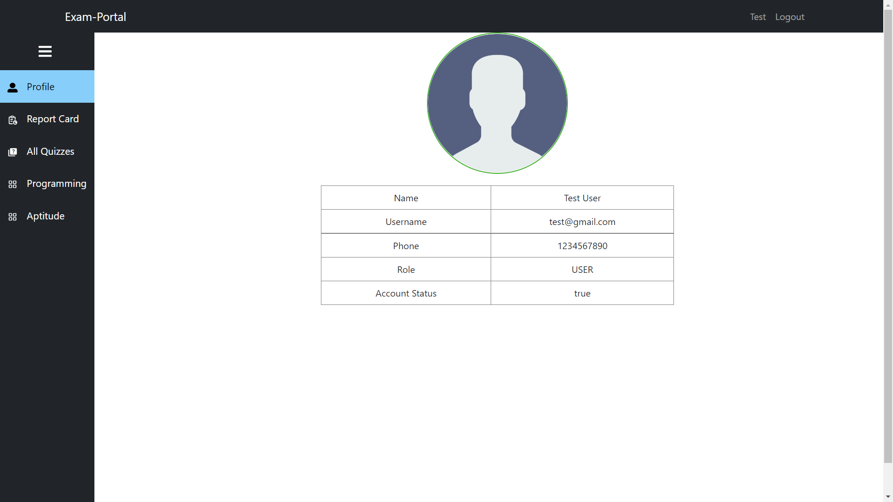

- User All Quizzes Page 
  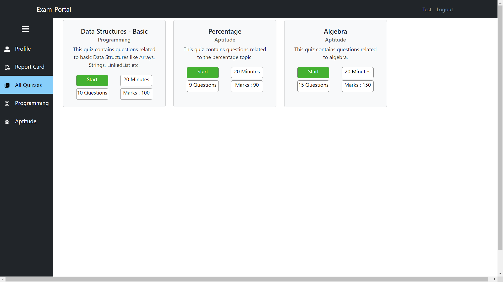

- User Category-wise Quizzes Page 
  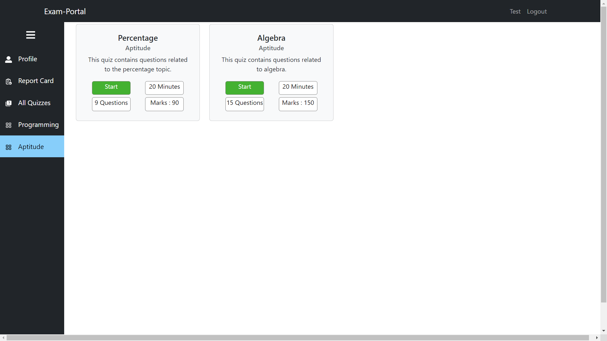

- User Question Page 
  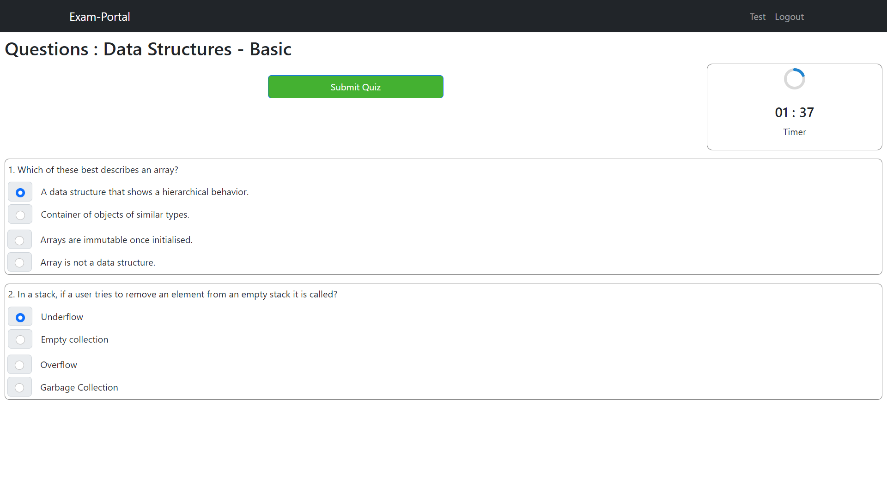

- User Quiz Submitted Alert 
  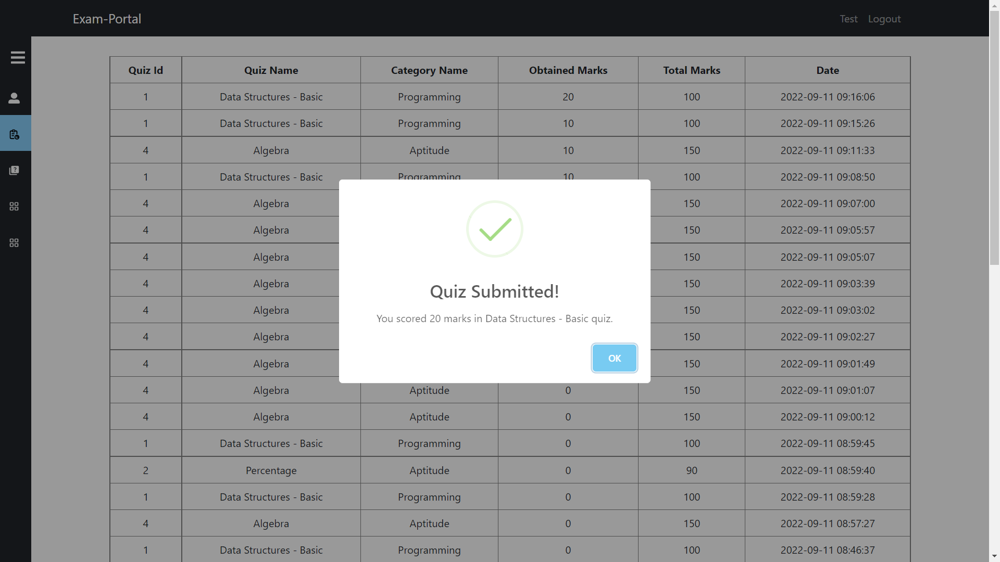

- User Quiz Manual Page 

- User Report Card Page 
  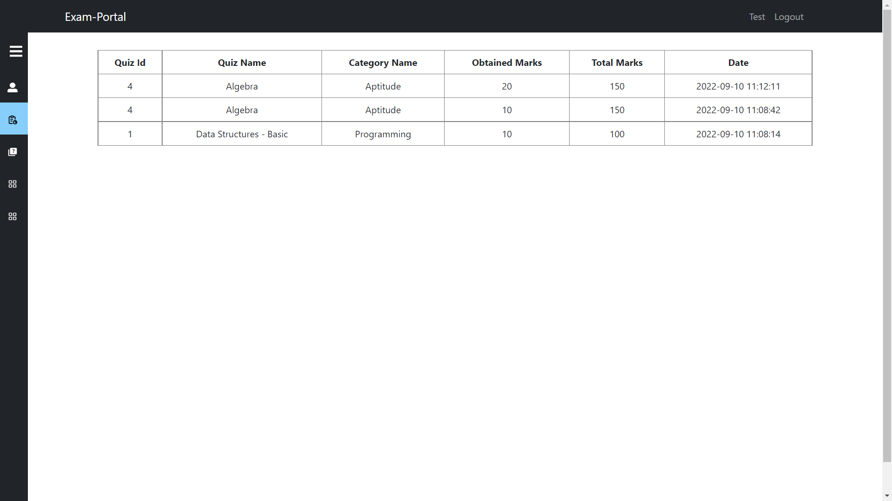
