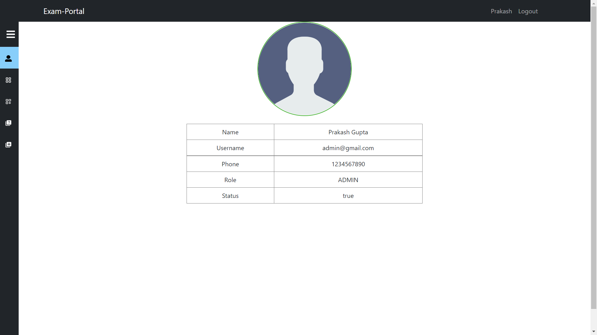

# Exam-Portal
This a webapp built using Spring-boot and ReactJS that provides functionality to conduct and take quizzes. Admin can add, update, delete different quizzes, the categories to which these quizzes belongs and also questions of those quizzes. While normal user can attempt those quizzes as well as see the scorecards of their previous attempts.

## Note:-
Admin Module is completed. User Module is in progress...

## Output :-

- Login Page 

- Registration Page 

- Admin Profle Page 

- Admin Categories Page 

- Admin Add Category Page 

- Admin Update Category Page 

- Admin Delete Category Alert 

